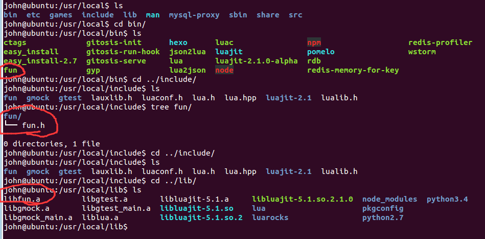
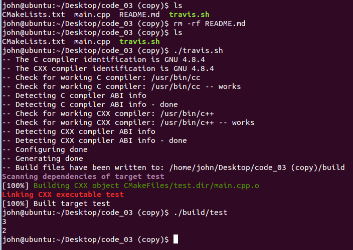

# 简单的cmake INSTALL

* CMakeLists.txt
将可执行文件安装到bin目录下

CMAKE_INSTALL_PREFIX的默认定义是/usr/local(默认安装目录)

```
PROJECT (HELLO)
INCLUDE_DIRECTORIES(.)
SET(SRC_LIST main.cpp fun.cpp)
ADD_EXECUTABLE(hello ${SRC_LIST})

INSTALL(TARGETS hello
        RUNTIME DESTINATION bin
        )

```


* camke的时候指定安装目录前缀

例如要将可执行文件安装到 /usr/local/bin下，使用如下的语句
```
cmake -DCMAKE_INSTALL_PREFIX=/usr/local
```

或 安装到默认的目录
```
cmake .
```


接着安装、运行即可
```
$make
$sudo make install
```

```
john@ubuntu:~/cmake_study/code_01$ cmake -DCMAKE_INSTALL_PREFIX=/usr/local
CMake Warning (dev) in CMakeLists.txt:
  No cmake_minimum_required command is present.  A line of code such as

    cmake_minimum_required(VERSION 2.8)

  should be added at the top of the file.  The version specified may be lower
  if you wish to support older CMake versions for this project.  For more
  information run "cmake --help-policy CMP0000".
This warning is for project developers.  Use -Wno-dev to suppress it.

-- Configuring done
-- Generating done
-- Build files have been written to: /home/john/cmake_study/code_01
john@ubuntu:~/cmake_study/code_01$ make
[100%] Built target hello
john@ubuntu:~/cmake_study/code_01$ sudo make install
[100%] Built target hello
Install the project...
-- Install configuration: ""
-- Installing: /usr/local/bin/hello
```

---

# cmake install 头文件，静态库，可执行文件

* 在code_04的基础上 src/CMakeLists.txt需要改写

```
INCLUDE_DIRECTORIES(${PROJECT_SOURCE_DIR}/libfun)

link_directories(${PROJECT_BINARY_DIR}/lib)

set(APP_SRC main.cpp)

# 可执行文件生成在 build/bin下面
set(EXECUTABLE_OUTPUT_PATH ${PROJECT_BINARY_DIR}/bin)

# 生成可执行文件
add_executable(fun ${APP_SRC})

# 可执行文件 需要链接 静态库
target_link_libraries(fun libfun)

# install 
INSTALL(TARGETS fun
        RUNTIME DESTINATION bin
        )
#INSTALL(PROGRAMS ${PROJECT_BINARY_DIR}/bin/fun 
#       DESTINATION bin 
#       PERMISSIONS OWNER_EXECUTE OWNER_WRITE OWNER_READ GROUP_EXECUTE GROUP_READ)

INSTALL(FILES ${PROJECT_SOURCE_DIR}/libfun/fun.h DESTINATION include/fun)

INSTALL(FILES ${PROJECT_BINARY_DIR}/lib/libfun.a DESTINATION lib)

```

*　接着仍然是在build目录下
```
$cmake ..
$make 
$suod make install
```

* 安装后截图

```
john@ubuntu:~/cmake_study/code_04/build$ sudo make install
[sudo] password for john: 
[ 50%] Built target libfun
[100%] Built target fun
Install the project...
-- Install configuration: ""
-- Installing: /usr/local/bin/fun
-- Removed runtime path from "/usr/local/bin/fun"
-- Installing: /usr/local/include/fun/fun.h
-- Installing: /usr/local/lib/libfun.a

```



* 编写测试代码
测试自己安装的代码，见code_test_01文件夹下的代码
测试运行截图



---

