windows下 cmake使用

* 下载安装cmake,设置环境变量

* 安装一个vs,如vs2015

# 使用code_01下的工程

cmake将生成vs解决方案

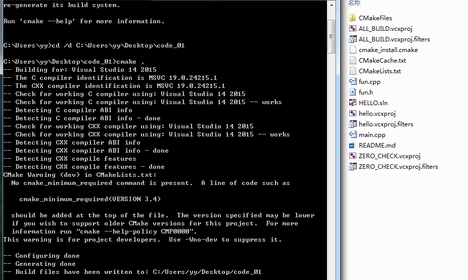

打开解决方案后

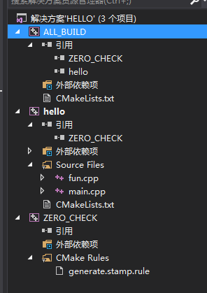

* 将三个项目重新生成一下

* 然后设置hello为主启动工程，打开main.cpp，然后运行即可


# 使用code_04下的工程（有静态库）

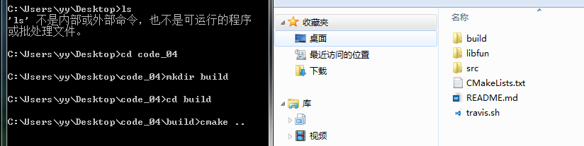

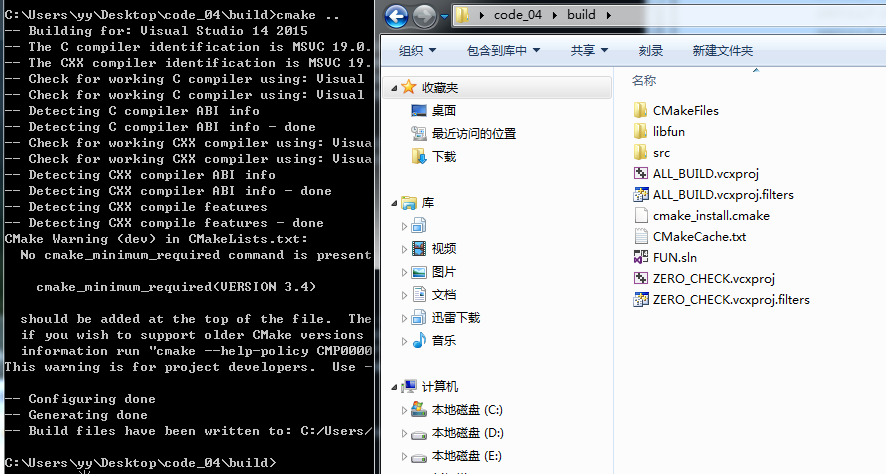


打开解决方案后有4个工程

* 将项目重新生成一下

查看项目属性，可以看到fun工程是链接了静态库的（头文件目录,引用的.lib）

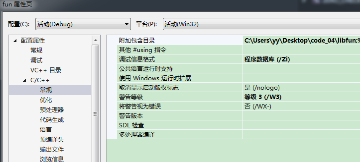

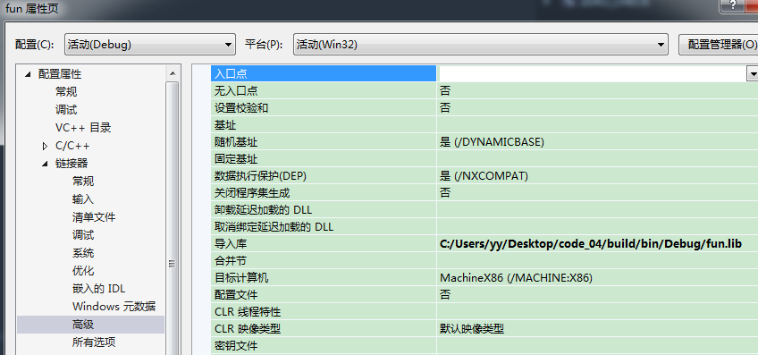

* 然后设置fun为主启动工程，打开main.cpp，然后运行即可

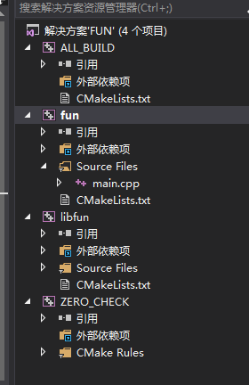

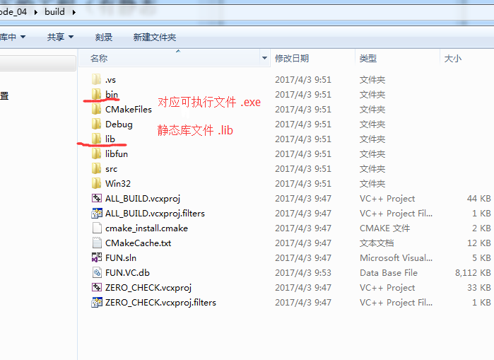


# 使用code5(使用动态库)--发现问题---改写代码--解决问题

## windows使用动态库注意点

* windows使用动态库必须要有 .lib 和 .dll(不像linux下只需要一个.so)
lib文件是必须在编译期就链接到应用程序中的，而dll文件是运行期才会被调用的。

参考如下
http://blog.csdn.net/yusiguyuan/article/details/12649737

* windows vs一般以debug或release方式运行，常出现找不到DLL这种错误,只要将dll拷到对应的.exe目录下就行了

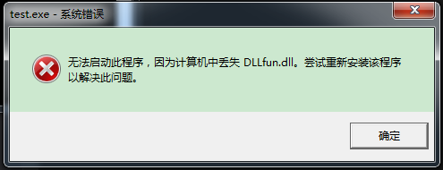

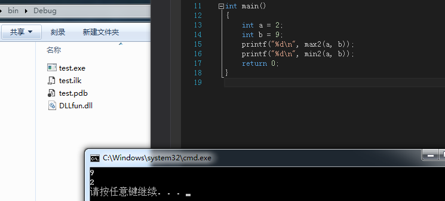


## 利用code5代码做了很多修改，并且调了下才运行成功

fun.h 直接注释掉了那些 #if #endif

```
#ifndef _FUN_
#define _FUN_

#include <cstdio>

using namespace std;

//#if defined _WIN32
//    #if LIBFUN_BUILD
//        #define LIBFUN_API __declspec(dllexport) // 如果生成dll工程，那么导出
//    #else
//        #define LIBFUN_API __declspec(dllimport) // 如果生成使用dll的工程，那么导入
//    #endif
//#else
//    #define LIBFUN_API
//#endif
//
//LIBFUN_API int max2(int, int);
//LIBFUN_API int min2(int, int);

int max2(int, int);
int min2(int, int);

#endif
```

* 链接库的名字（原来照着网上博文写的，发现现在错了，库名字在windows和linux下不一样的）

* 需要自己修改（我发现CMakeLists文件工程名字成了它项目链接的库文件名字，但这是不对的？）

* fun.def文件，定义了连接的dll名字

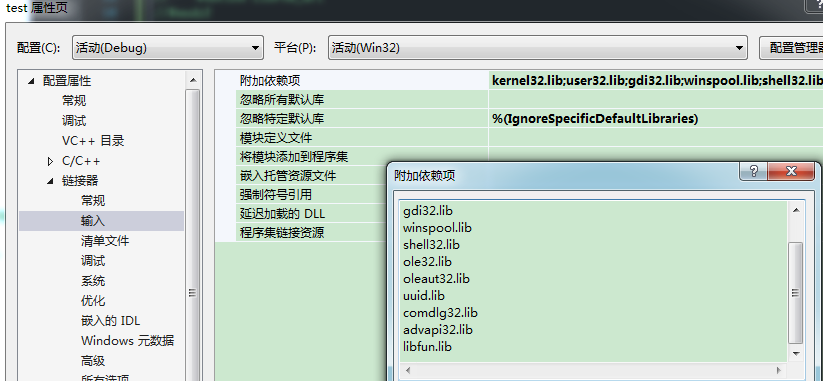


**注： 可能是cmake,vs都升级了原因，原来的博文太老了，现在都用vs2015了，所以原来的文章没注明环境的都太坑，只可借鉴，不能照着学？？？**

---

## 代码见dll_code目录（linux win32+vs2015测试成功调用动态库文件）

具体见代码，下面是win32操作步骤

* 直接运行.bat 会建立build目录，然后进入 cmake

* 用vs2015打开后，重新生成项目(.lib, .dll等都将生成出来

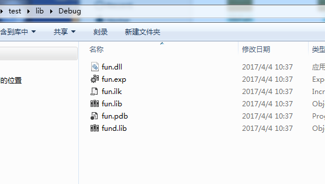

* 直接运行出错，需要把项目test设置为启动项运行，但仍然出错（找不到dll）

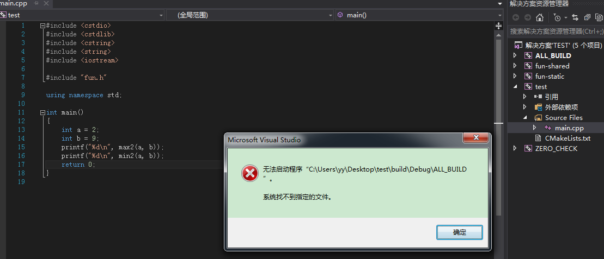

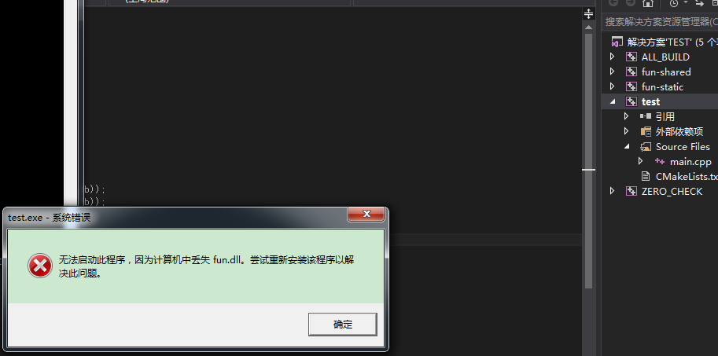

* 将dll拷贝到与exe一起的目录，然后运行成功

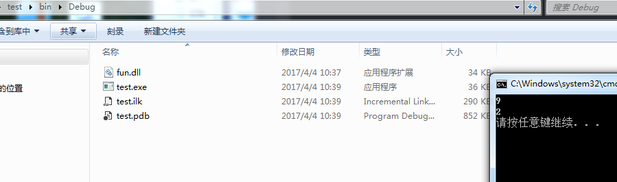


---